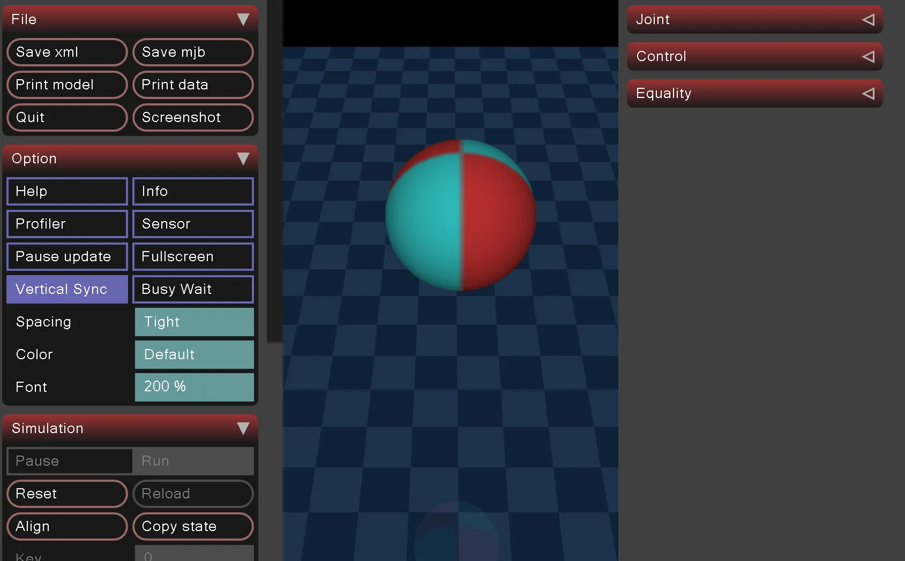

# MuJoCo小白教程：键盘控制球体，位置移动、姿态旋转

## 目录

- [一、程序整体结构概览](#一程序整体结构概览)
- [二、库导入与环境准备](#二库导入与环境准备)
- [三、键盘状态管理](#三键盘状态管理)
  - [3.1 按键状态字典](#31-按键状态字典)
  - [3.2 按键事件回调函数](#32-按键事件回调函数)
  - [3.3 启动键盘监听](#33-启动键盘监听)
- [四、XML模型文件详解](#四xml模型文件详解)
  - [4.1 根节点与全局设置](#41-根节点与全局设置)
  - [4.2 资源定义（`<asset>`）](#42-资源定义asset)
  - [4.3 世界主体（`<worldbody>`）](#43-世界主体worldbody)
- [五、加载模型与初始化数据](#五加载模型与初始化数据)
- [六、核心控制类：`BallControl`](#六核心控制类ballcontrol)
  - [6.1 初始化方法（`__init__`）](#61-初始化方法__init__)
  - [6.2 核心控制方法（`apply_control`）](#62-核心控制方法apply_control)
    - [6.2.1 初始化变量](#621-初始化变量)
    - [6.2.2 位置移动控制](#622-位置移动控制)
    - [6.2.3 旋转控制（四元数详解）](#623-旋转控制四元数详解)
    - [6.2.4 状态更新与物理同步](#624-状态更新与物理同步)
- [七、启动仿真与可视化](#七启动仿真与可视化)
- [八、程序运行与交互效果](#八程序运行与交互效果)

这个程序实现了一个可以通过键盘控制的球体，包括位置移动和姿态旋转，非常适合理解物理仿真中的运动控制和四元数应用。



## 一、程序整体结构概览

首先看程序的整体框架，主要分为以下几个部分：

1. 导入必要的库（MuJoCo、numpy、pynput等）
2. 定义键盘状态管理（记录按键按下/释放状态）
3. 编写XML模型文件（描述仿真环境和球体实体）
4. 实现核心控制类`BallControl`（处理位置移动和旋转逻辑）
5. 启动仿真循环（将模型、控制逻辑和可视化结合）

这种结构体现了物理仿真程序的典型设计：模型定义-交互输入-控制逻辑-仿真循环的闭环流程。

## 二、库导入与环境准备

```python
import mujoco
import mujoco.viewer
import numpy as np
from pynput import keyboard
```

+ `mujoco`：MuJoCo物理引擎的核心库，负责加载模型、计算物理运动
+ `mujoco.viewer`：提供可视化窗口，用于实时显示仿真效果
+ `numpy`：处理数值计算（尤其是向量和矩阵运算，四元数计算依赖它）
+ `pynput.keyboard`：监听键盘事件，实现用户交互控制

## 三、键盘状态管理

### 3.1 按键状态字典

```python
key_states = {
    # 移动控制键
    keyboard.Key.up: False,    # 前 (X+)
    keyboard.Key.down: False,  # 后 (X-)
    keyboard.Key.left: False,  # 左 (Y-)
    keyboard.Key.right: False, # 右 (Y+)
    ',': False,  # 上 (Z+)
    '.': False,  # 下 (Z-)
  
    # 旋转控制键
    '1': False,  # X轴正向旋转
    '2': False,  # X轴负向旋转
    '3': False,  # Y轴正向旋转
    '4': False,  # Y轴负向旋转
    '5': False,  # Z轴正向旋转
    '6': False   # Z轴负向旋转
}
```

这个字典用于记录每个控制键的状态（`True`表示按下，`False`表示释放）。需要注意：

+ 方向键属于`keyboard.Key`类的特殊按键，直接作为字典的键
+ 数字键（1-6）和标点键（,、.）是字符类型，用字符串作为键
+ 初始状态均为`False`（未按下）

### 3.2 按键事件回调函数

```python
def on_press(key):
    try:
        # 处理特殊按键（如方向键）
        if key in key_states:
            key_states[key] = True
        # 处理数字键和字符键
        elif hasattr(key, 'char') and key.char in key_states:
            key_states[key.char] = True
    except Exception as e:
        print(f"按键错误: {e}")

def on_release(key):
    try:
        # 处理特殊按键释放
        if key in key_states:
            key_states[key] = False
        # 处理字符键释放
        elif hasattr(key, 'char') and key.char in key_states:
            key_states[key.char] = False
    except Exception as e:
        print(f"释放错误: {e}")
```

这两个函数是键盘事件的回调：

+ `on_press`：当按键被按下时触发，将对应键的状态设为`True`
+ `on_release`：当按键被释放时触发，将对应键的状态设为`False`
+ `hasattr(key, 'char')`用于判断是否为字符键（数字、标点等）

### 3.3 启动键盘监听

```python
listener = keyboard.Listener(on_press=on_press, on_release=on_release)
listener.start()
```

通过`keyboard.Listener`启动一个后台线程，实时监听键盘事件并更新`key_states`字典。这种方式不会阻塞主程序的运行。

## 四、XML模型文件详解

MuJoCo使用XML格式定义仿真世界，包括物理参数、几何体、材质等。我们逐部分解析：

### 4.1 根节点与全局设置

```xml
<mujoco>
  <option gravity="0 0 0"/>  <!-- 关闭重力，方便观察控制效果 -->
  <visual>
    <headlight diffuse="0.6 0.6 0.6" ambient="0.3 0.3 0.3" specular="0 0 0"/>
    <global azimuth="140" elevation="-30"/>
  </visual>

```

+ `<mujoco>`：根节点，包含整个仿真模型
+ `<option gravity="0 0 0"/>`：关闭重力（默认重力是(0,0,-9.81)），避免球体因重力下落，方便专注于控制逻辑
+ `<visual>`：视觉渲染设置
  - `headlight`：设置 headlights（类似手电筒）的光照参数，diffuse（漫反射）、ambient（环境光）、specular（高光）
  - `global azimuth="140" elevation="-30"`：设置初始视角，azimuth（方位角）、elevation（仰角）

### 4.2 资源定义（`<asset>`）

```xml
<asset>
  <texture type="2d" name="ball_texture" builtin="checker" rgb1="0.8 0.2 0.2" rgb2="0.2 0.8 0.8" width="100" height="100"/>
  <material name="ball_material" texture="ball_texture" texuniform="true"/>
  <!-- 增强地面纹理 -->
  <texture type="2d" name="floor_texture" builtin="checker" width="512" height="512" rgb1="0.2 0.3 0.4" rgb2="0.1 0.2 0.3"/>
  <material name="floor_material" texture="floor_texture" texrepeat="6 6" texuniform="true" reflectance="0.2"/>
</asset>

```

`<asset>`用于定义可复用的资源（纹理、材质等）：

+ `<texture>`：定义纹理
  - `builtin="checker"`：使用内置的棋盘格纹理
  - `rgb1`和`rgb2`：棋盘格的两种颜色（球体用红-蓝，地面用深蓝-浅蓝）
  - `width`和`height`：纹理分辨率（地面用512x512更清晰）
+ `<material>`：将纹理应用到几何体，并设置材质属性
  - `texture`：关联前面定义的纹理
  - `texrepeat="6 6"`：地面纹理重复6x6次，避免拉伸模糊
  - `reflectance="0.2"`：设置反射率，让地面有轻微反光效果

### 4.3 世界主体（`<worldbody>`）

```xml
<worldbody>
  <!-- 优化地面效果 -->
  <geom name="floor" type="plane" size="3 3 0.1" rgba="0.8 0.9 1 1" material="floor_material"/>
  
  <body name="ball" pos="0 0 1">
    <freejoint/>
    <geom type="sphere" size="0.2" material="ball_material" mass="5"/>
  </body>
</worldbody>

```

`<worldbody>`包含仿真世界中的所有物理实体：

1. 地面（`<geom name="floor">`）
   - `type="plane"`：平面几何体
   - `size="3 3 0.1"`：平面大小（x方向3米，y方向3米，厚度0.1米）
   - `material="floor_material"`：应用前面定义的地面材质
2. 球体（`<body name="ball">`）
   - `pos="0 0 1"`：初始位置在(0,0,1)（x=0, y=0, z=1，离地面1米高）
   - `<freejoint/>`：自由关节，允许球体在3D空间中做6自由度运动（3平移+3旋转）
   - `<geom type="sphere">`：球体几何体
     * `size="0.2"`：半径0.2米
     * `material="ball_material"`：应用球体纹理
     * `mass="5"`：质量5kg（影响物理仿真中的惯性）

## 五、加载模型与初始化数据

```python
model = mujoco.MjModel.from_xml_string(XML)
data = mujoco.MjData(model)
```

+ `model = mujoco.MjModel.from_xml_string(XML)`：将XML字符串解析为MuJoCo的模型对象（`MjModel`），包含所有静态信息（几何体、关节、材质等）
+ `data = mujoco.MjData(model)`：创建数据对象（`MjData`），存储动态信息（位置、速度、力等），随仿真步骤更新

## 六、核心控制类：`BallControl`

这个类封装了球体的所有控制逻辑，包括位置移动和旋转处理。

### 6.1 初始化方法（`__init__`）

```python
class BallControl:
    def __init__(self):
        self.rotation_angle = np.pi / 18  # 10度旋转角度（弧度制）
        self.move_step = 0.2  # 移动步长（米）
        self.last_key_states = dict(key_states)  # 记录上一帧的按键状态
```

+ `self.rotation_angle`：每次旋转的角度（10度，转换为弧度：π/18 ≈ 0.1745 rad）
+ `self.move_step`：每次移动的距离（0.2米）
+ `self.last_key_states`：保存上一次的按键状态，用于检测"按键状态变化"（从释放到按下的瞬间）

### 6.2 核心控制方法（`apply_control`）

这个方法是整个程序的"大脑"，负责解析按键状态并更新球体的位置和姿态。

#### 6.2.1 初始化变量

```python
def apply_control(self, key_states):
    changed = False  # 标记状态是否有变化
    # 对于自由关节，qpos前3个是位置，后4个是四元数
    current_pos = data.qpos[:3].copy()  # 位置 (x, y, z)
    current_quat = data.qpos[3:7].copy()  # 四元数 (w, x, y, z)
```

+ `changed`：用于标记是否有位置或姿态的更新，避免无效计算
+ `data.qpos`：自由关节的状态向量，共7个元素：
  - 前3个：位置坐标 (x, y, z)
  - 后4个：四元数 (w, x, y, z)，表示姿态

#### 6.2.2 位置移动控制

位置控制的逻辑是：当按键从"未按下"变为"按下"时，沿对应轴移动固定步长。

```python
# 上箭头键: 向前移动 (沿X轴正方向)
if key_states[keyboard.Key.up] and not self.last_key_states.get(keyboard.Key.up, False):
    current_pos[0] += self.move_step
    changed = True
    print("上箭头: 向前移动 (X+)")
```

+ 条件判断`key_states[按键] and not self.last_key_states[按键]`：只在按键"刚被按下"时触发（边缘检测），避免按住按键时连续移动
+ `current_pos[0] += self.move_step`：X轴正方向移动（X+）
+ 其他方向的移动逻辑相同，仅坐标轴和方向不同：
  - 下箭头：X轴负方向（X-）→ `current_pos[0] -= move_step`
  - 左箭头：Y轴负方向（Y-）→ `current_pos[1] -= move_step`
  - 右箭头：Y轴正方向（Y+）→ `current_pos[1] += move_step`
  - 逗号键：Z轴正方向（Z+）→ `current_pos[2] += move_step`
  - 句号键：Z轴负方向（Z-）→ `current_pos[2] -= move_step`

#### 6.2.3 旋转控制（四元数详解）

旋转控制是重点，使用四元数表示姿态，避免欧拉角的万向锁问题。我们分步骤解析：

##### （1）四元数的基本概念

任意3D旋转都可以用四元数`(w, x, y, z)`表示，其数学定义为：

+ `w = cos(θ/2)`，其中`θ`是旋转角度
+ `x = a * sin(θ/2)`
+ `y = b * sin(θ/2)`
+ `z = c * sin(θ/2)`

其中`(a, b, c)`是旋转轴的单位向量（`a² + b² + c² = 1`）。

##### （2）单轴旋转四元数的生成

以"1键：绕X轴正向旋转10度"为例：

```python
# 1键: X轴正向旋转
if key_states['1'] and not self.last_key_states.get('1', False):
    axis = np.array([1, 0, 0])  # X轴单位向量
    # 计算旋转四元数
    rot_quat = np.array([np.cos(self.rotation_angle/2), *np.sin(self.rotation_angle/2)*axis])
    # 四元数乘法：当前姿态 × 新旋转
    mujoco.mju_mulQuat(current_quat, rot_quat, current_quat)
    changed = True
    print("1键: 绕X轴正向旋转+10度")
```

+ `axis = [1, 0, 0]`：X轴的单位向量
+ `self.rotation_angle = π/18`（10度），因此`θ/2 = π/36`（5度）
+ 计算四元数分量：
  - `w = cos(π/36) ≈ 0.996`（5度的余弦值）
  - `x = 1 * sin(π/36) ≈ 0.087`（5度的正弦值）
  - `y = 0 * sin(π/36) = 0`
  - `z = 0 * sin(π/36) = 0`
  - 因此`rot_quat ≈ [0.996, 0.087, 0, 0]`

##### （3）负向旋转的处理

以"2键：绕X轴负向旋转10度"为例：

```python
# 2键: X轴负向旋转
if key_states['2'] and not self.last_key_states.get('2', False):
    axis = np.array([1, 0, 0])  # X轴
    rot_quat = np.array([np.cos(-self.rotation_angle/2), *np.sin(-self.rotation_angle/2)*axis])
    mujoco.mju_mulQuat(current_quat, rot_quat, current_quat)
    changed = True
    print("2键: 绕X轴负向旋转-10度")
```

负向旋转只需将角度取负（`-θ`），此时：

+ `cos(-θ/2) = cos(θ/2)`（余弦是偶函数）
+ `sin(-θ/2) = -sin(θ/2)`（正弦是奇函数）
+ 因此负向旋转的四元数为`[0.996, -0.087, 0, 0]`

##### （4）四元数乘法与旋转叠加

`mujoco.mju_mulQuat(current_quat, rot_quat, current_quat)`的作用是将当前姿态与新旋转叠加，其数学意义是：

```plain
新姿态 = 当前姿态 × 新旋转四元数
```

这是"左乘"规则，即新的旋转叠加在当前姿态上。需要特别注意四元数乘法的物理意义与向量旋转公式的区别：

+ **向量旋转公式**：`v' = q × v × q⁻¹`
  这是用四元数`q`旋转向量`v`（表示为纯四元数）的标准公式，其中`q⁻¹`是`q`的共轭（对于单位四元数，`q⁻¹ = (w, -x, -y, -z)`），作用对象是空间中的点或向量，结果是计算向量经旋转后的新坐标。
+ **姿态复合逻辑**：`新姿态 = 当前姿态 × 新旋转`
  这是叠加旋转操作的方式，作用对象是物体的姿态四元数，物理意义是"先应用新旋转，再应用当前姿态对应的旋转"，最终得到叠加后的姿态。

由于四元数乘法不满足交换律（`A×B ≠ B×A`），旋转顺序不同会导致结果不同：

+ 先按1键（X轴+10度）再按3键（Y轴+10度）：
  a. 第一次旋转后四元数`q1 ≈ [0.996, 0.087, 0, 0]`
  b. 第二次旋转的四元数`q2 ≈ [0.996, 0, 0.087, 0]`
  c. 最终姿态`q = q1 × q2 ≈ [0.992, 0.087, 0.087, -0.008]`
+ 先按3键（Y轴+10度）再按1键（X轴+10度）：
  a. 第一次旋转后四元数`q2 ≈ [0.996, 0, 0.087, 0]`
  b. 第二次旋转的四元数`q1 ≈ [0.996, 0.087, 0, 0]`
  c. 最终姿态`q' = q2 × q1 ≈ [0.992, 0.087, 0.087, 0.008]`

两者的差异体现在四元数的z分量符号上（`-0.008` vs `0.008`），这是三维旋转非交换性的直接体现。

##### （5）其他轴旋转的逻辑

Y轴和Z轴的旋转逻辑与X轴完全一致，仅旋转轴不同：

+ Y轴旋转：`axis = [0, 1, 0]`
+ Z轴旋转：`axis = [0, 0, 1]`

#### 6.2.4 状态更新与物理同步

当位置或姿态有变化时，需要更新物理状态：

```python
if changed:
    # 更新位置和姿态到物理数据对象
    data.qpos[:3] = current_pos
    data.qpos[3:7] = current_quat
    # 重置速度以避免物理抖动（手动控制时不需要惯性）
    data.qvel[:] = 0
    # 向前计算物理状态（更新所有派生量）
    mujoco.mj_forward(model, data)
  
    # 打印当前状态，方便观察
    print("当前状态:")
    print(f"位置坐标 (x, y, z): ({current_pos[0]:.3f}, {current_pos[1]:.3f}, {current_pos[2]:.3f})")
    print(f"四元数 (w, x, y, z): ({current_quat[0]:.3f}, {current_quat[1]:.3f}, {current_quat[2]:.3f}, {current_quat[3]:.3f})")
    print("-" * 40)
```

+ `data.qpos[:] = ...`：将计算后的位置和四元数写入物理数据对象
+ `data.qvel[:] = 0`：重置速度（如果不重置，MuJoCo会根据位置变化计算速度，导致球体"抖动"）
+ `mujoco.mj_forward(model, data)`：根据当前状态更新所有物理派生量（如坐标系变换、惯性等），确保可视化正确

## 七、启动仿真与可视化

```python
ball_control = BallControl()

with mujoco.viewer.launch_passive(model, data) as viewer:
    # 打印控制说明
    print("=" * 50)
    print("球体控制说明:")
    # ... 省略说明文字 ...
  
    while viewer.is_running():
        # 处理控制逻辑
        ball_control.apply_control(key_states)
      
        # 推进仿真一步（计算物理运动）
        mujoco.mj_step(model, data)
        # 同步视图（将物理状态更新到可视化窗口）
        viewer.sync()
```

+ `mujoco.viewer.launch_passive`：启动被动模式的可视化窗口（用户控制仿真步长）
+ `while viewer.is_running()`：仿真主循环，窗口关闭时退出
+ `mujoco.mj_step(model, data)`：推进物理仿真一步（根据模型和当前数据计算下一时刻的状态）
+ `viewer.sync()`：将最新的物理状态同步到可视化窗口，刷新显示

## 八、程序运行与交互效果

运行程序后，会出现一个带棋盘格纹理的球体和地面，控制台会打印控制说明。通过按键可以：

+ 方向键和逗号/句号键：控制球体在X/Y/Z轴上移动，每次移动0.2米
+ 数字1-6键：控制球体绕X/Y/Z轴旋转，每次旋转10度
+ 每次操作后，控制台会输出当前的位置坐标和四元数，方便观察姿态变化

例如：

+ 先按1键（X+10度）再按3键（Y+10度），四元数约为`(0.992, 0.087, 0.087, -0.008)`
+ 先按3键（Y+10度）再按1键（X+10度），四元数约为`(0.992, 0.087, 0.087, 0.008)`

这一差异正是四元数乘法非交换性的实际体现，也印证了"姿态复合"与"向量旋转"的逻辑区别。
